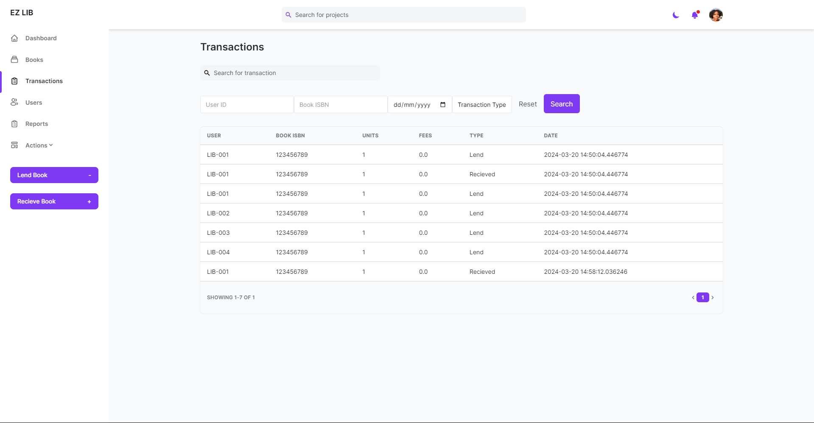
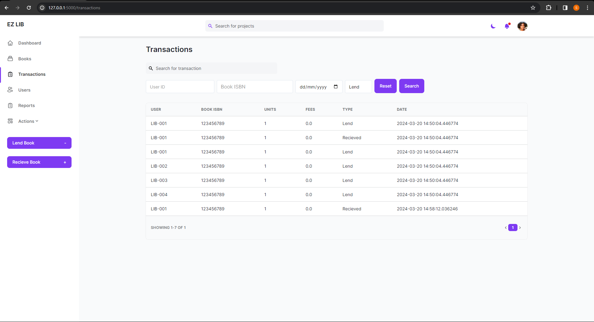
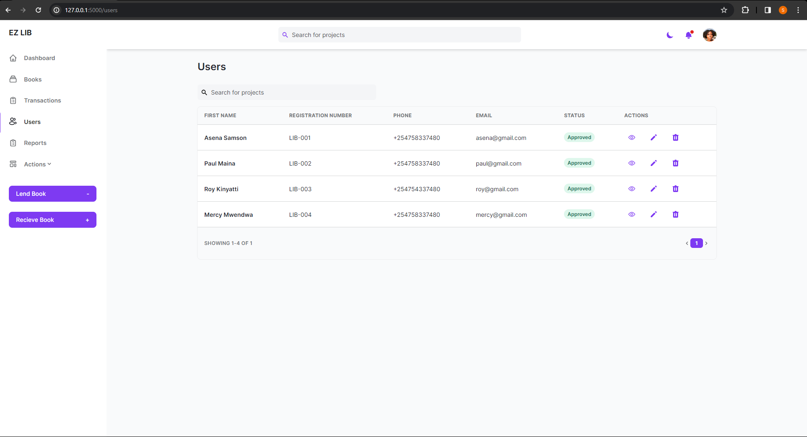
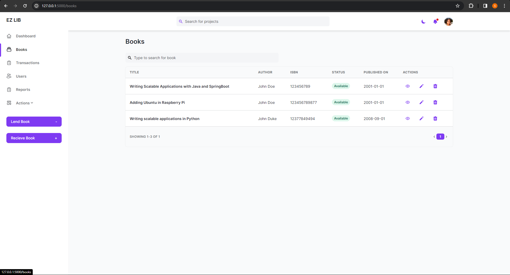
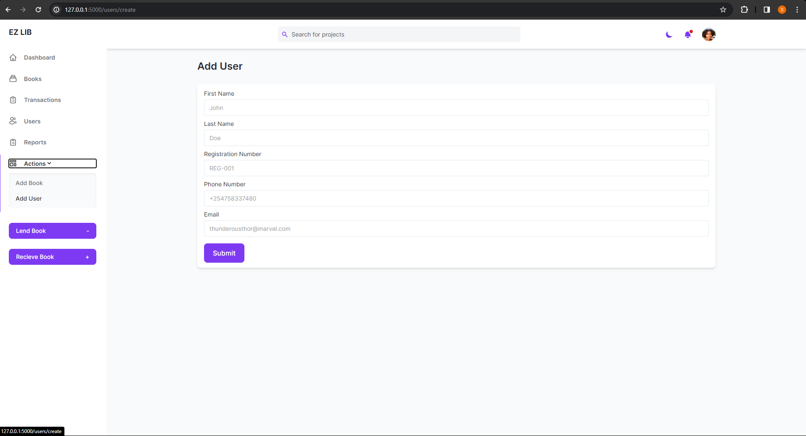
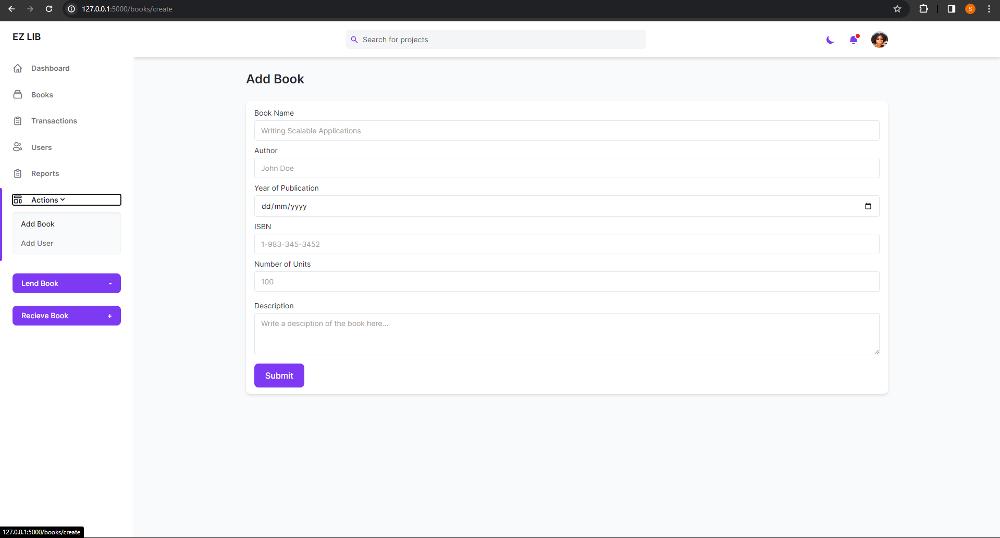
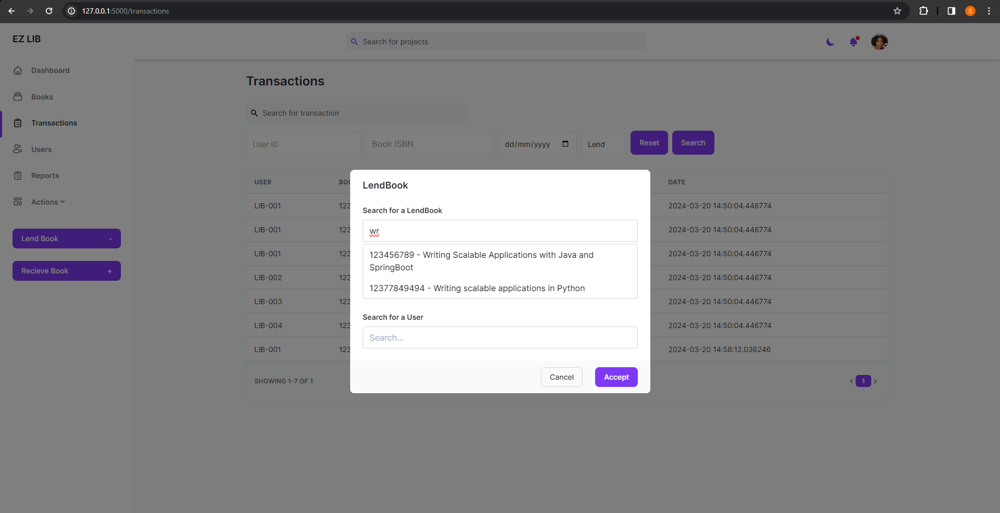
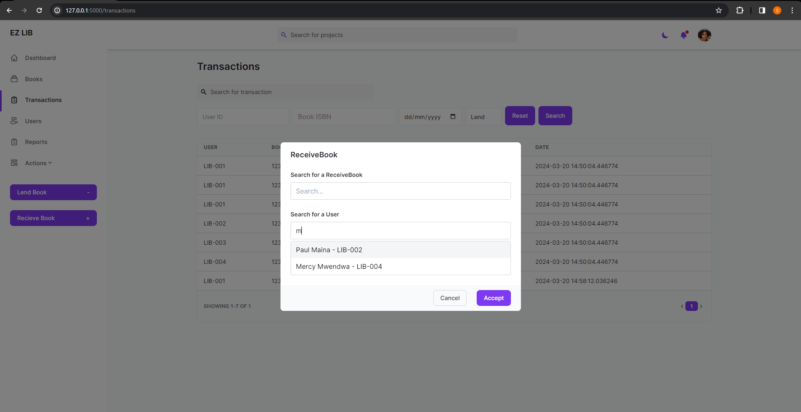

# FLASK LIBRARY MANAGEMENT SYSTEM

This is a library management system that enables one to add a book  to the system, add a user and issue a book and request a return.



## Table of Contents

- [Overview](#overview)
- [Features](#features)
- [Tech Stack](#tech-stack)
- [Getting Started](#getting-started)
  - [Installation](#installation)
  - [Running the Application](#running-the-application)
- [Screenshots](#screenshots)


## Overview

This is a library management system that enables one to add a book  to the system, add a user and issue a book and request a return.

The directory structure is as below :

    | - project_root/
    |   | - app/
    |   |   | - services/
    |   |   |   | - books/
    |   |   |   | - main/
    |   |   |   | - reports/
    |   |   |   | - transactions/
    |   |   |   | - users/
    |   |   | - static/
    |   |   |   | - css/
    |   |   |   | - js/
    |   |   | - templates/
    |   |   |   | - books/
    |   |   |   | - error/
    |   |   |   | - reports/
    |   |   |   | - shared/
    |   |   |   | - transactions/
    |   |   |   | - users/
    |   |   | - utils/
    |   |   | - models/
    |   | - .gitignore
    |   | - configs.py
    |   | - run.py
    |   | - requirements.txt
    |   | - readme.md
    |   | - tests

P.S.
Each individual service has to have a init file as a module in python and a views file where each route lies. 


## Features

List the key features or functionalities of the project.

- Create a Book, User
- Issue a book to a User 
- Fuzzy Search for a book that is available before issuing 
- Recieve a book from a User
- Fuzzy Search for a book that is pending (issued to someone)
- Create an immutable record of the transactions (issue and recieve)


- I am partiularly excited about the pending book search algorithm that uses the immutable transaction records to check if a user has a pending book 

TODO : 
- Send Flash notification back to users
- Ability to update both user details and book details
- Feed report data to dashboard and reports page !

## Tech Stack

List the technologies and libraries used in the project.

- Flask
- HTML
- Tailwind CSS
- AlpineJS
- SQLite

## Getting Started

### Installation

1. Clone the repository:

   ```bash
   git clone https://github.com/asenawritescode/flask-library-system.git 
   ```

2. Install dependencies:

    ```bash
    pip install -r requirements.txt
    ```

### Running the Application

1. Run the application CLI

    ```bash
    python run.py runserver
    ```

2. Access the application on the browser at 'http://localhost:5000'


## Screenshots








